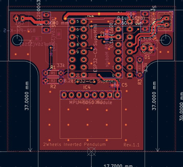
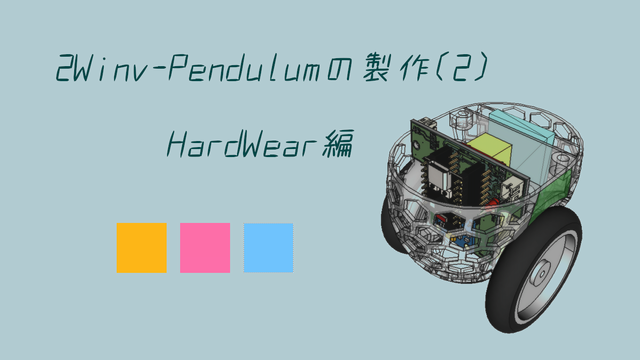

車輪型(2輪)倒立振子の製作ファイル

ここは、倒立振子の制御基板(回路CAD)ファイル、のリポジトリとなります。

This is a repository for inverted pendulum control board (circuit CAD) files.

//

製作内容は、下記youtubeをご参照下さい。

Please refer to the YouTube link below for details of the production.

https://www.youtube.com/watch?v=W9z1Mw9BegU

